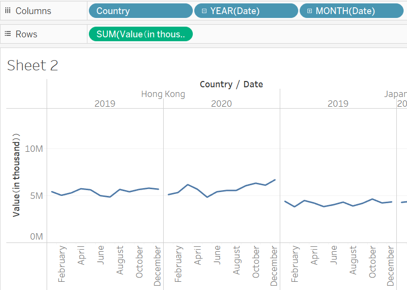
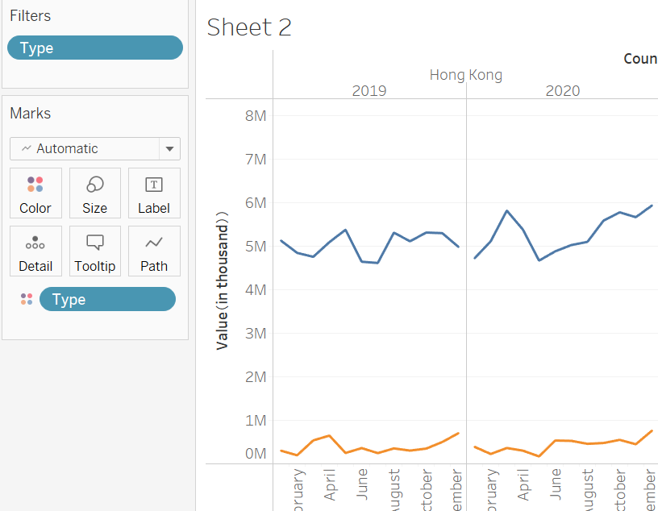
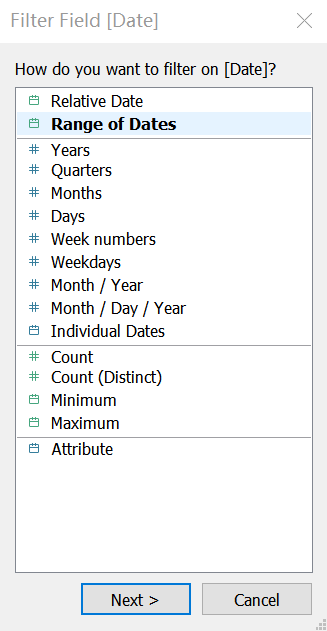
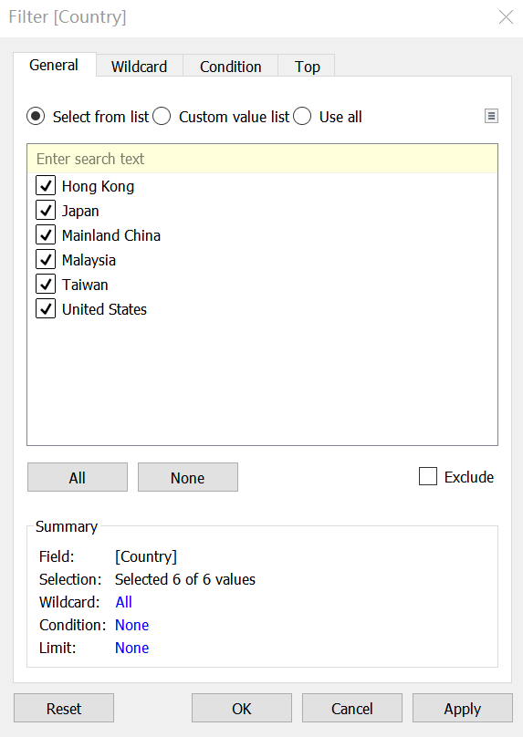
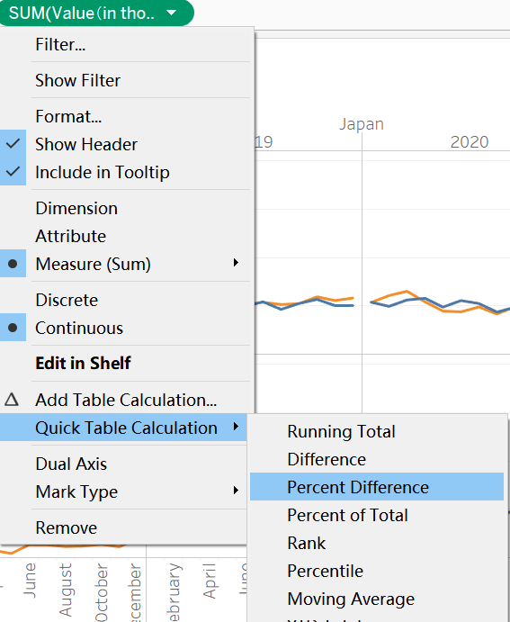
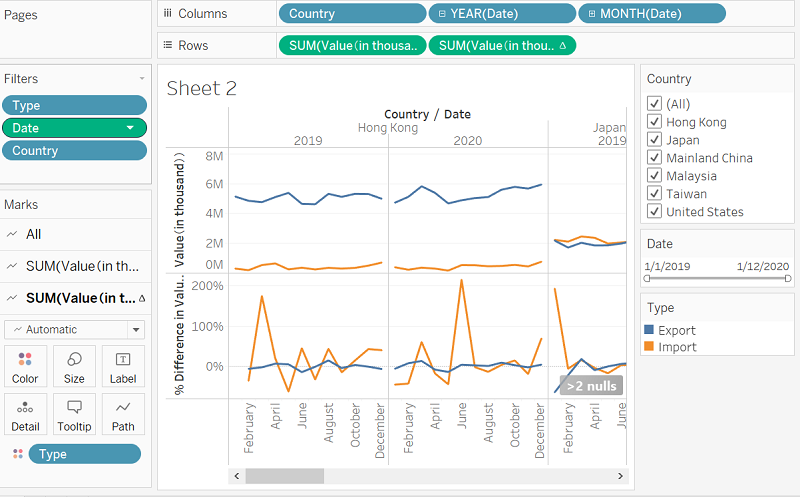
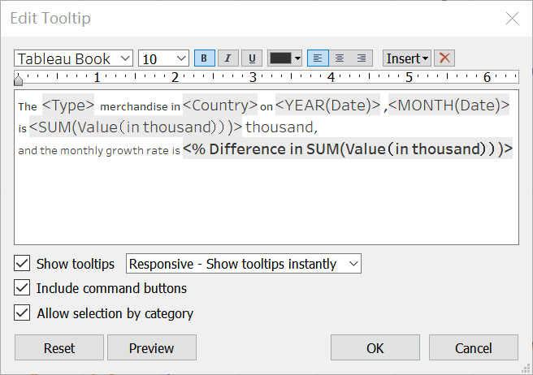
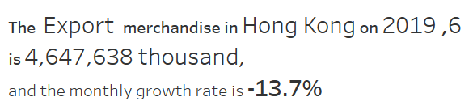
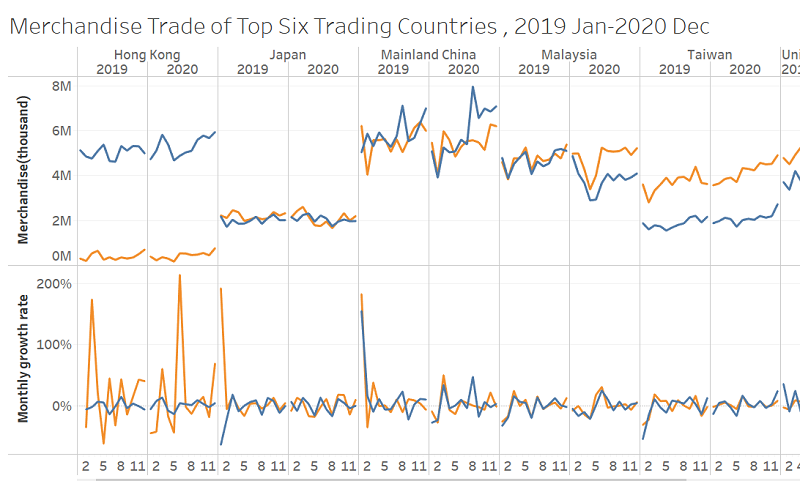

```{r setup, include=FALSE}
knitr::opts_chunk$set(echo = FALSE)
```
# 1.0 Critiques of the graph

The original visualisation can be seen below.


## 1.1 Clarity

* The mark on the region is not obvious enough, and it is difficult to confirm the name of the country during initial observation.
* The date on the x-axis is not clear enough to determine the month included in the data. It is hard to know the month that the graph include. Therefore, data information cannot be obtained intuitively.
* The range of the y-axis is different. In the graph of a certain country, the range of the y-axis is different, so the trade balance cannot be seen. In the same way, in different countries, the y-axis range is also different and it is impossible to intuitively compare the trade differences between different regions.
* The type of graphic selection. In this figure, the part below the line chart is filled with color, but it is not conducive to observing the overall trend of change.

## 1.2 Aesthetics

* Choice of color and transparency. Although the picture has a certain degree of transparency, it is very inconvenient to observe after the two colors are mixed, especially when the import is greater than the export, the export value is hidden.
* Different graph size. The six countries shown in this graph have different graph sizes in each country, so it is difficult to explore effective information from this graph.
* The stacked form of graphics. Due to the large number of countries studied, the six graphs are stacked together in a 2*3 manner, which makes the originally small graphs smaller and more difficult to see subtle changes.


# 2.0 Sketch of the proposed design
With reference to Critic , an alternative representation is sketched below.


## 2.1 Clarity

* Change the chart to a line chart makes it easier to compare the difference between imports and exports.
* The year and month of the x-axis are clear, and the date can be adjusted at the same time, so that it is easy to find the exact date or time period.
* Add the value of Monthly growth rate. We can see the trend of changes in imports and exports more intuitively


## 2.2 Aesthetic

* Arrange all countries horizontally to facilitate comparison between different countries. In addition, we can select any one or more countries.
* Colour is used to bring to attention different Type, import or export.
* Separate the statistics for the two years, and list the year at the top of the chart.


# 3.0 Proposed Visualisation designed in Tableau

Please view the interactive visualisation on Tableau Public [here](https://public.tableau.com/app/profile/huining.tang/viz/MerchandiseTrade_16223827330810/Sheet1)


# 4.0 A step-by-step description of how the data visualization was prepared

1. Delete extra values in the original database using excel, change file name into import and export.


2. Import the data into Tableau.Link two charts.


3. Change data type to number.


4. Use Tableau to pivot the data in both sheet. Drop measure values into columns and Measure names and country into rows.


5. Select all values from 2019 Jan to 2020 Dec from the Import/Export sheet, measure in sum. Delete other extra values.Do this in both sheets. 


6. View Data and export all data.


7. Repeat the following steps for both Import and Export sections.Use Microsoft Excel to merge two files, add a new Type column to identify the type.


8. Import the cleaned dataset into Tableau.Change column name into more clearer one.


9. Change Date data type into 'Date'.


10.Add Country, Date(YEAR) and Date(Month) to the Column tab and Sum(Value) to the Rows tab.


11. Add a filter to seperate the import and export value.


12. Add a filter to choose the range of date.


13. Add another filter to compare difference between countries.


14. Drop Value(in thousand) to the Rows tab, use quick table calculation to get the mongthly growth rate.



15.The base graph should look like this.



16.Change the title of the chart.

17.Change the month on the x-axis into number to make the graph clearer.

18.Change the name of y-axis.

19.Adjust the size of the picture so that more countries can be seen on the interface under the condition of being able to see clearly.

20.Change the tooltip.

21. The tooltip will look like below.


21. The final dashboard.




# 5.0 Three major observations revealed by the data visualisation prepared

* The export value of Hong Kong and Taiwan is obviously greater than the import value, and there is a trade surplus. The foreign trade of these two countries is in a favorable position. But this may affect a country's currency to some extent.

* In general, the imports and exports of commodities in the remaining countries have an upward trend, of which Taiwan and China have the most obvious upward trends. It is worth noting that in the first quarter of 2020, the import and export of merchandise in different countries all have a certain degree of decline, of which Malaysia has the largest volatility. This may be related to the COVID-19 outbreak in early 2020.

* The monthly changes in imports and exports are similar.The monthly changes in imports and exports are similar. Judging from the changes in the monthly growth rate in the figure, the imports and exports of countries usually increase or decrease at similar rates. In addition to national macro-control factors, trade between countries also has mutual influence. This also shows that the ratio of a country's imports and exports is basically maintained in a stable range.


