```{r setup, include=FALSE}
knitr::opts_chunk$set(echo = FALSE)
```
# 1.0 Critiques of the graph

The original visualisation can be seen below.
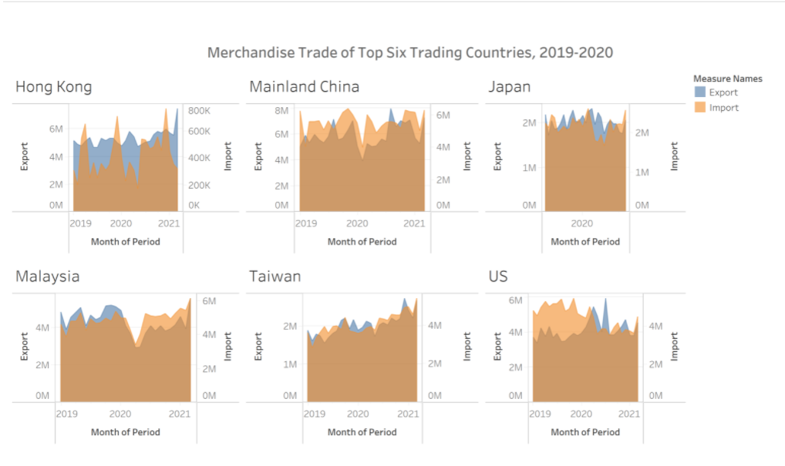

## 1.1 Clarity

* The mark on the region is not obvious enough, and it is difficult to confirm the name of the country during initial observation.
* The date on the x-axis is not clear enough to determine the month included in the data. It is hard to know the month that the graph include. Therefore, data information cannot be obtained intuitively.
* The range of the y-axis is different. In the graph of a certain country, the range of the y-axis is different, so the trade balance cannot be seen. In the same way, in different countries, the y-axis range is also different and it is impossible to intuitively compare the trade differences between different regions.
* The type of graphic selection. In this figure, the part below the line chart is filled with color, but it is not conducive to observing the overall trend of change.

## 1.2 Aesthetics

* Choice of color and transparency. Although the picture has a certain degree of transparency, it is very inconvenient to observe after the two colors are mixed, especially when the import is greater than the export, the export value is hidden.
* Different graph size. The six countries shown in this graph have different graph sizes in each country, so it is difficult to explore effective information from this graph.
* The stacked form of graphics. Due to the large number of countries studied, the six graphs are stacked together in a 2*3 manner, which makes the originally small graphs smaller and more difficult to see subtle changes.


# 2.0 Sketch of the proposed design
With reference to Critic , an alternative representation is sketched below.
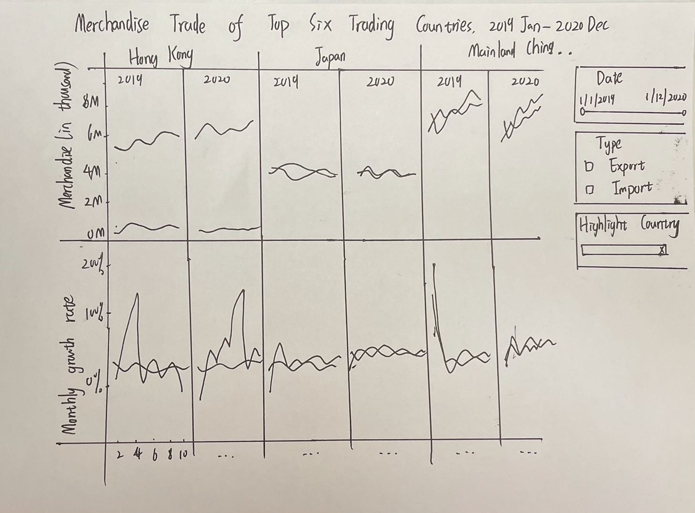

## 2.1 Clarity


## 2.2 Aesthetic
packages = c('ggpubr', 'tidyverse')


# 3.0 Proposed Visualisation designed in Tableau

Please view the interactive visualisation on Tableau Public [here](网页)


# 4.0 A step-by-step description of how the data visualization was prepared

1. Delete extra values in the original database using excel, change file name into import and export.


2. Import the data into Tableau.Link two charts.
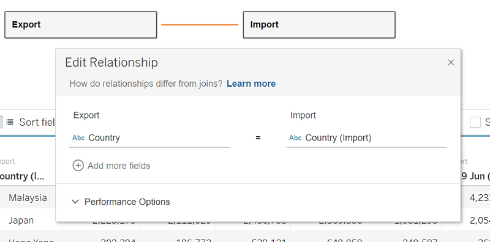
3. Change data type to number. 
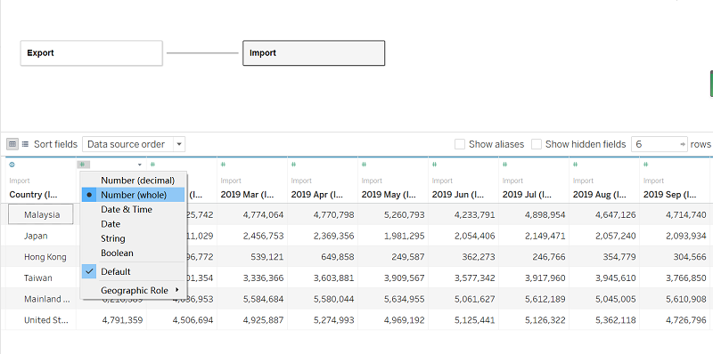
4. Use Tableau to pivot the data in both sheet. Drop measure values into columns and Measure names and country into rows.
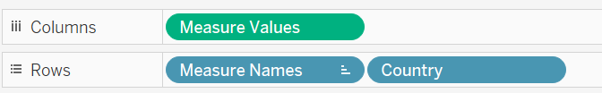
5. Select all values from 2019 Jan to 2020 Dec from the Import/Export sheet, measure in sum. Delete other extra values.Do this in both sheets.  
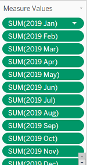
6. View Data and export all data.
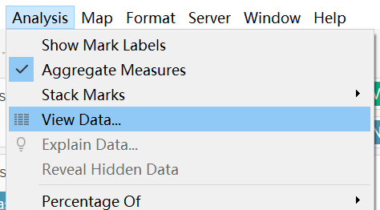
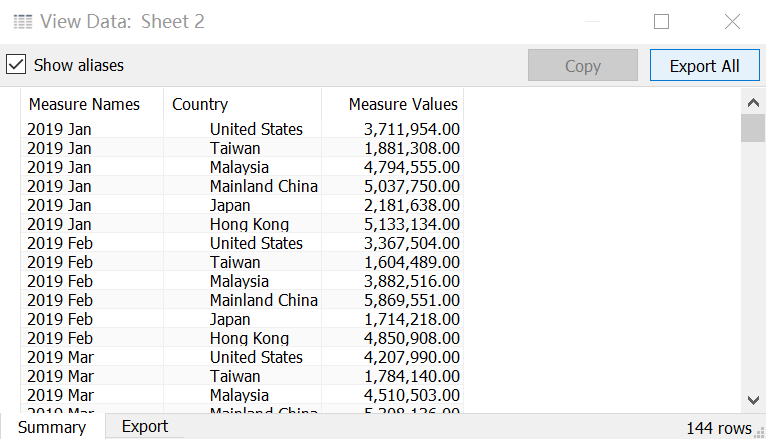
7. Repeat the following steps for both Import and Export sections.Use Microsoft Excel to merge two files, add a new Type column to identify the type.
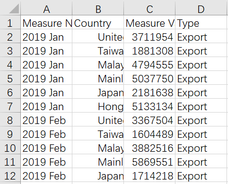
8. Import the cleaned dataset into Tableau.Change column name into more clearer one.
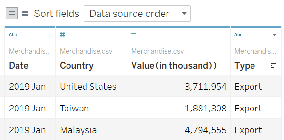
9. Change Date data type into 'Date'.
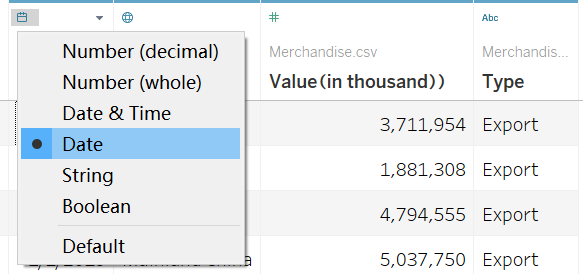
10.
Add
# 5.0 Three major observations revealed by the data visualisation prepared


