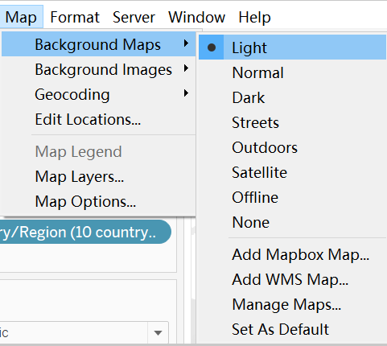

```{r setup, include=FALSE}
knitr::opts_chunk$set(echo = FALSE)
```

- [1.0 Critiques of the graph](#10-critiques-of-the-graph)
  * [1.1 Clarity](#11-clarity)
  * [1.2 Aesthetics](#12-aesthetics)
- [2.0 Sketch of the proposed design](#20-sketch-of-the-proposed-design)
  * [2.1 Clarity](#21-clarity)
  * [2.2 Aesthetic](#22-aesthetic)
- [3.0 Proposed Visualisation designed in Tableau](#30-proposed-visualisation-designed-in-tableau)
- [4.0 A step-by-step description of how the data visualization was prepared](#40-a-step-by-step-description-of-how-the-data-visualization-was-prepared)
- [5.0 Three major observations revealed by the data visualisation prepared](#50-three-major-observations-revealed-by-the-data-visualisation-prepared)


# 1.0 Critiques of the graph

The original visualisation can be seen below.

{width=50%}


## 1.1 Clarity

* **Reference line**. There is a lack of reference lines. Although we could know which country or region has a larger total amount, we can not tell the details of export and import.
* **Note**.The note is long and seems not that useful, the size of the word are also a bit small which made it ard to read.
* **Lack geographic image** We only know the countries or region but we do not have a idea of where the country is whether it is near Singapore or not.
* **Date** Only shows the total merchandise of 2020. If people want to make a comparison of other years, they could only explore by themselves.


## 1.2 Aesthetics

* **Color**. Too many colors and some similar colors . Too many colors may cause confusion. In addition, there are some similar colors. For example, the colors of Mainland China are similar to the background, and the colors of EU and Thailand are indistinguishable.
* **Graphic size**. The circles corresponding to each country are too large and overlap each other, making it impossible to visually observe and compare them.
* **Label**. The Labels gives details about country/region and the amount.But as it always shows on the graph, which made the graph disorganized. 

# 2.0 Sketch of the proposed design
With reference to Critic , an alternative representation is sketched below.


## 2.1 Clarity

* **Background**.Make the background of the graph blank.It will be easier and intuitive to observe each data of each country/region.
* **Geographic graph**.Add geograpic graph to see the location of the countries and regions. We could further explore whether the merchandise trade is related to the location.
* **Reference line** Add appropriate reference line to directly relate the small part related with the x-axis and y-axis.
* **Date**.Add the date of year from 2011-2020. We could compare the change of different aspects and explore more.

## 2.2 Aesthetic

* **Color**.Change the color from country/region to the merchandise trade amount.We could tell directly which country has the min/max merchandise trade amount.
* **Size**.Reduce the size of graphics, avoid graphics overlap and confusion.
* **Label**.Not always show labels.Leave the country/region name and exclude others. We could find the details as long as click on the graph.


# 3.0 Proposed Visualisation designed in Tableau

Please view the interactive visualisation on Tableau Public [here](https://public.tableau.com/app/profile/huining.tang/viz/DataViz-2_16241911265180/Dashboard1)

# 4.0 A step-by-step description of how the data visualization was prepared

|No     |Step         |Action|
|:-----:|:------------:|:---------------------------------------------------:|
|1|Use Excel to delete redundant data. As we also consider the Europe Union, keep data from EU countries.There're 34 country/region left.|{width=90%}|
|2|Add missing country of EU to T1 and T2|{width=90%}|
|3|Use Tableau to import data and connect T1 and T2 with country|{width=90%}|
|4|Pivot the data of all dates in both T1 and T2|{width=90%}|
|5|We got three columns of data. Change the name of each column.|{width=90%}|
|6|Export both data sites to csv.|{width=90%}|
|7|Combine the two files.|{width=90%}|
|8|Import the data into Tableau,change into correct data types.|{width=90%}|
|9|Custom split the Country/Region column|{width=80%}|
|10|We got two new column which represent for Country and what the value is in.|{width=80%}|
|11|Create calculation field to make all value in million but not thousand.Do the same to Export|{width=80%}|
|12|Hide redundant vales, we got these four columns for further analysis.|{width=90%}|
|13|Create group of Country/Region to devide country of Europe Union.|{width=80%}|
|14|Create a group with ten regions and one EU  group.|{width=90%}|
|15|Create a group with EU countries and one other region group. |{width=90%}|
|16|Drag Import to columns and export to rows|{width=70%}|
|17|Drag Country/Region(10 country/region) to details and use filter to exclude EU.|{width=90%}|
|18|Then our graph looked like this.|{width=90%}|
|19|Create a new calculation field to calculate the amount of Export minus Import.|{width=90%}|
|20|Create a new calculation field to calculate the amount of Export plus Import.|{width=90%}|
|21|Drop Export+Import to Size.|{width=30%}|
|22|Change the size.|{width=50%}|
|23|Change the shape to circle|{width=30%}|
|24|Edit color.|{width=50%}|
|25|Change opacity to 60%.|{width=30%}|
|26|Show drop lines.|{width=50%}|
|27|Drag Country/Region(10 country/region) to label and custom the format.|{width=50%}|
|28|Add new calculation to determine Trade deficit.|{width=70%}|
|29|Add new calculation to determine Trade surplus.|{width=70%}|
|30|Drag Trade deficit and Trade surplus to detail. |{width=70%}|
|31|Change tool tip like this.|{width=90%}|
|32|Add median rference line on both x-axis and y-axis|{width=40%}|
|33|Open another sheet. Drag Latitude and Longitude to Column and row.|{width=70%}|
|34|Drag Country/Region(10 country/region) to Filter.|{width=50%}|
|35|Drag Country/Region(10 country/region)，Trade deficit and Trade surplus to detail，|{width=50%}|
|36|Select light background map.|{width=50%}|
|37|Drag Country/Region(10 country/region) to label and set as selected to show the country name when click on it.|{width=40%}|
|38|Change tool tip like this.|{width=80%}|
|39|Edit Color|{width=70%}|
|40|Create new sheet, Drag Latitude and Longitude to Column and row.|{width=80%}|
|41|Drag country/Region(EU) to filter and exclude other countries.|{width=50%}|
|42|Do almost the same drags as in the last sheet|{width=50%}|
|43|Change the label.|{width=40%}|
|44|Edit the color.|{width=60%}|
|45|Create a dashboard and combine three graphs reasonably.|{width=50%}|
|46|Edit all titles.|{width=90%}|
|47|Apply date filter to all using related data sources.|{width=80%}|


# 5.0 Three major observations revealed by the data visualisation prepared

* In these ten countries/regions.Tailand had the lowest merchandise amount during the ten years. However, before 2014, Malaysia’s total merchandise transaction volume is the highest. However, after 2014, the total volume of commodity transactions between China and Singapore gradually exceeded that of Malaysia.China has become the most valuable commodity trading partner.In addition, Malaysia’s total merchandise trade in 2020 has dropped significantly, which may be related to the COVID-19 epidemic.

|Year   |Merchandise Performance|Year   |Merchandise Performance|
|:-----:|:--------------------------:|:-----:|:--------------------------:|
|2013|{width=90%}|2019|{width=90%}|
|2014|{width=90%}|2020|{width=90%}|

* In general, four regions' export exceeds import.They are China, Thailand, Indonesia and Malaysia.The Europe Union always has the largest amount of tet import value. This may be related to te business partern of different countries.As we see, the situation are consist until 2020, we assume it is because the breakout of Covid-19.We took 2017 and 2020 as an example to compare the difference.Malaysia and United States changed most.

|Year   |Export-Import|
|:-----:|:---------------------------------------------------------:|
|2017|{width=90%}|
|2020|{width=90%}|
* As for Europe, almost all countries has a positive net import value.However, only two countries, Belgium and Netherlands always has a negative net import value. Both of these countries are the top ten exporters in the world. The Netherlands mainly exports dairy products and crops, while Belgium mainly exports diamonds and chemical products.


