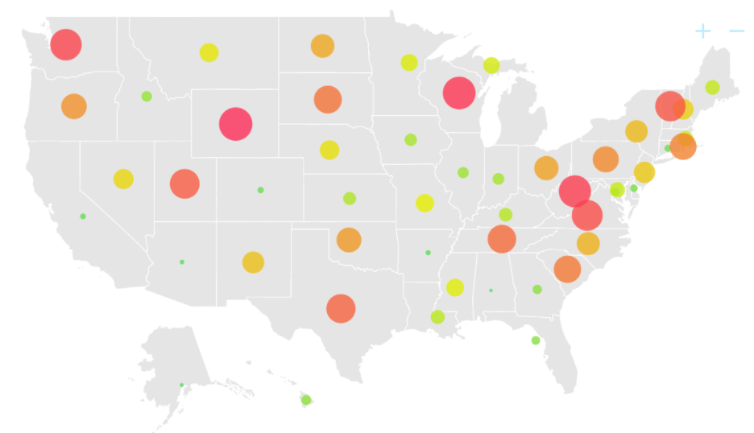
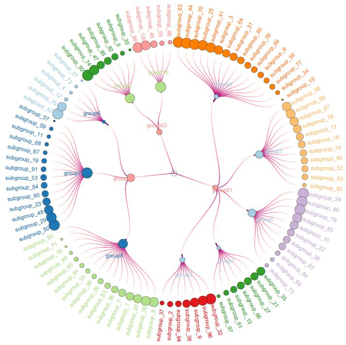

```{r setup, include=FALSE}
knitr::opts_chunk$set(echo = FALSE)
```

# 1.Introduction

The background of the study is that in January, 2014, when the leaders of GAStech are celebrating the initial public offering of their very successful company, several employees of GAStech go missing. As GAStech has not been as successful in demonstrating environmental stewardship, the organization known as the Protectors of Kronos (POK) is suspected in the disappearance.The company hopes to obtain abnormal personal relationships based on the trajectory of all employees' actions and consumption before the employees disappeared, so as to determine whether these people are related to the missing employees.


## 2.Lecture Review

The analysis of the criminal suspect's trajectory and the relationship with the victim are important clues to criminal cases.For analyzing the character's trajectory, there is an increasing trend of usage of line plots, geographic maps, heat maps, histograms, and graphs for time series data. Here are some examples.

{width=50%}

The method commonly used in analyzing the relationship between characters is Node relationship graph.

{width=50%}


# 3 Data import and preparation

## Library preparing

```{r}
packages = c("tidyverse","tibble","ggiraph","sf","ggplot2","ggspatial","dplyr",
             "raster","tmap","clock","highcharter","ggforce")
for (p in packages){
  if (!require(p,character.only = T)){
    install.packages(p)
    }
  library(p,character.only = T)
}
```


# 4 Analytics and Visualization

## 4.1 Anomalies in the credit and loyalty card data

## 4.2 Insights after adding vehicle data

## 4.3 Infer the owners of each credit card and loyalty card

## 4.4 Potential informal or unofficial relationships among GASTech personnel

## 4.5 Suspicious activity
