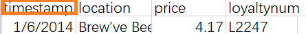
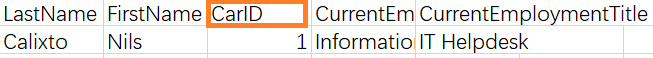

```{r setup, include=FALSE}
knitr::opts_chunk$set(echo = FALSE)
```

# 1.Introduction

The background of the study is that in January, 2014, when the leaders of GAStech are celebrating the initial public offering of their very successful company, several employees of GAStech go missing. As GAStech has not been as successful in demonstrating environmental stewardship, the organization known as the Protectors of Kronos (POK) is suspected in the disappearance.The company hopes to obtain abnormal personal relationships based on the trajectory of all employees' actions and consumption before the employees disappeared, so as to determine whether these people are related to the missing employees.


## 2.Lecture Review

The analysis of the criminal suspect's trajectory and the relationship with the victim are important clues to criminal cases.For analyzing the character's trajectory, there is an increasing trend of usage of line plots, geographic maps, heat maps, histograms, and graphs for time series data. Here are some examples.

{width=50%}

The method commonly used in analyzing the relationship between characters is Node relationship graph.

{width=50%}


# 3 Data preparation

## 3.1 Packages preparing

The code are like this.

```{r eval=TRUE, echo=TRUE}
packages = c("tidyverse","tibble","ggiraph","sf","ggplot2","ggspatial","dplyr",
             "raster","tmap","clock","highcharter","ggforce",'lubridate','readr')
for (p in packages){
  if (!require(p,character.only = T)){
    install.packages(p)
    }
  library(p,character.only = T)
}
```

We need these packages for analysing and visualization. Expected mapping includes histogram, trajectory graph, heat map, node graph and so on.

## 3.2 Data preprocessing

After a glimpse of the several csv files, we could find the raw data has  garbled code due to language problems. As this is a problem of name of Location, it mainly exists in credit card data and loyalty card data.

{width=60%}

We solved the problem in excel before importing data into R to avoid risk of mistakes.

Also, as we may need to join different data frame, we shall change the name of columns before importing data.

{width=40%} 
{width=40%}
{width=40%}
{width=50%}

So we would change the CardID to **id** and all timestamp to **Timestamp**.

Then we could import data for further analysis.

# 4 Analytics and Visualization


## 4.1 Anomalies in the credit and loyalty card data

```{r eval=TRUE, echo=TRUE}
loyalty <- read_csv('data/loyalty_data.csv')
creditcard <- read_csv('data/cc_data.csv')
loyalty$Timestamp = mdy(loyalty$Timestamp)
creditcard$Timestamp = mdy_hm(creditcard$Timestamp)
```

```{r eval=TRUE, echo=TRUE}
loyalty_aggregated <- data.frame(loyalty[c('Timestamp','location')])
loyalty_aggregated$type <- "loyalty"
creditcard_aggregated <- data.frame(creditcard[c('Timestamp','location')])
creditcard_aggregated$type <- "creditcard"
total <- rbind(loyalty_aggregated,creditcard_aggregated)
```

```{r eval=TRUE, echo=TRUE}
library(dplyr)
location_group<- group_by(total,location,type)
GroupBylocation <- summarise(location_group,count = n())
```

```{r eval=TRUE, echo=TRUE}
ggplot(GroupBylocation, aes(x = reorder(location,-count), y = count, fill = type)) +
  geom_bar(position = "dodge",width=0.8,stat="identity")+
  labs(title = "Frequency of Location", x="Location", y="Frequency")+
  theme(axis.text.x = element_text(size = 8, 
                                   family = "myFont", 
                                   angle = 90))
```

```{r eval=TRUE, echo=TRUE}
library(dplyr)
timestamp_group<- group_by(creditcard_aggregated,Timestamp,type)
GroupBytime <- summarise(timestamp_group,count = n())
GroupBytime$date <- strftime(as.POSIXlt(GroupBytime$Timestamp),"%d")
GroupBytime$hour <- strftime(as.POSIXlt(GroupBytime$Timestamp),"%H")
```

```{r eval=TRUE, echo=TRUE}
ggplot(GroupBytime, aes(date, hour)) + 
  geom_tile(aes(fill = count),
            colour = "grey") + 
  scale_fill_gradient(low = "white",
                      high = "steelblue")
```


## 4.2 Insights after adding vehicle data
```{r eval=TRUE, echo=TRUE}
bgmap<-raster("data/MC2-tourist.tif")
```

```{r eval=TRUE, echo=TRUE}
tmap_mode("plot")
tm_shape(bgmap) +
    tm_raster(bgmap,
              legend.show = FALSE)
```


```{r eval=TRUE, echo=TRUE}
tm_shape(bgmap) +
tm_rgb(bgmap, r = 1,g = 2,b = 3,
       alpha = NA,
       saturation = 1,
       interpolate = TRUE,
       max.value = 255)
```

```{r eval=TRUE, echo=TRUE}
Abila_st <- st_read(dsn = "data/Geospatial",
                    layer = "Abila")
```

```{r eval=TRUE, echo=TRUE}
gps <- read_csv("data/gps.csv")
car <- read_csv("data/car-assignments.csv")
gps$Timestamp = mdy_hms(gps$Timestamp)
gps_join <- gps %>% left_join(car, by = 'id')
```


```{r eval=TRUE, echo=TRUE}
credit_gps_join <- gps_join %>% inner_join(creditcard, by = 'Timestamp')
credit_gps_join$day <- as.factor(get_day(credit_gps_join$Timestamp))
```

```{r eval=TRUE, echo=TRUE}
gps_sf <- st_as_sf(credit_gps_join, 
                   coords = c("long", "lat"),
                       crs= 4326)
```


```{r eval=TRUE, echo=TRUE}
gps_path <- gps_sf %>%
  group_by(id) %>%
  summarize(m = mean(Timestamp), 
            do_union=FALSE) %>%
  st_cast("LINESTRING")
```


```{r eval=TRUE, echo=TRUE}
gps_path_selected <- gps_path %>%
  filter(id==1)
tmap_mode("view")
tm_shape(bgmap) +
  tm_rgb(bgmap, r = 1,g = 2,b = 3,
       alpha = NA,
       saturation = 1,
       interpolate = TRUE,
       max.value = 255) +
  tm_shape(gps_path_selected) +
  tm_lines(col = "orange")
```
## 4.3 Infer the owners of each credit card and loyalty card

## 4.4 Potential informal or unofficial relationships among GASTech personnel

## 4.5 Suspicious activity
